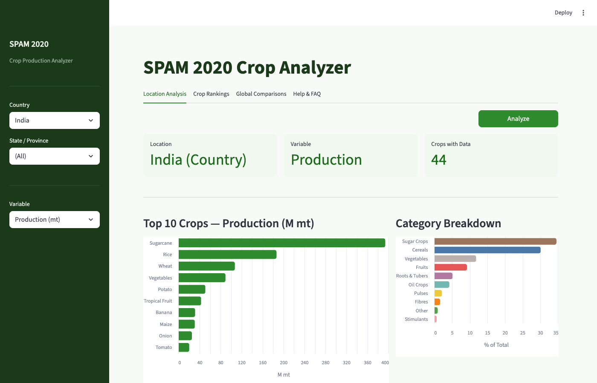

# SPAM 2020 Crop Analyzer

A Python tool for analyzing [MapSPAM 2020](https://www.mapspam.info/) global crop production data. Given any administrative region (country, state, or district), it computes crop production statistics from GeoTIFF raster data.



## Features

- **Location Analysis** — Select any country/state/district and see top crops with irrigated vs rainfed breakdown
- **Crop Rankings** — Rank regions by production, harvested area, or yield for any crop, with choropleth maps
- **Global Comparisons** — Compare a crop across all countries with side-by-side production, area, and yield charts
- **AI Assistant** — Ask questions about the SPAM dataset and methodology (powered by Claude)
- **46 crops, 4 variables** — Production, Harvested Area, Physical Area, Yield across all technology levels

## Data Coverage

| Level | Regions | Countries |
|-------|---------|-----------|
| Countries | 45 | 45 |
| States/Provinces | 1,309 | 55 |
| Districts | 26,727 | 57 |

Pre-built parquet indexes enable instant queries (sub-second) for all indexed regions.

## Quick Start

### Prerequisites

- Python 3.11+ (tested with 3.14)
- [Conda](https://docs.conda.io/) recommended for geospatial dependencies

### Installation

```bash
# Create conda environment with geospatial packages
conda create -n geo python=3.12 rasterio rasterstats geopandas -c conda-forge
conda activate geo

# Install remaining dependencies
pip install typer[all] rich pygadm pyarrow chromadb sentence-transformers anthropic streamlit streamlit-folium
```

### Download SPAM Data

Download the GeoTIFF ZIP files from [mapspam.info/data](https://www.mapspam.info/data/) and place them in `data/2020/`:

```
data/2020/
  spam2020V2r0_global_production.geotiff.zip
  spam2020V2r0_global_harvested_area.geotiff.zip
  spam2020V2r0_global_physical_area.geotiff.zip
  spam2020V2r0_global_yield.geotiff.zip
```

Optionally extract the ZIPs for faster processing (the tool uses extracted files when available).

### Initialize Boundaries

Download GADM administrative boundary data into the local cache:

```bash
python -m src.cli init-boundaries
```

### Build Indexes

Pre-compute crop statistics for fast queries:

```bash
# Country level (fast, ~30 min)
python -m src.cli build-index --level 0 --parallel 8

# State level (~2 hrs)
python -m src.cli build-index --level 1 --parallel 8

# District level (~8 hrs, run overnight)
nohup ./build_remaining_l2.sh > build_level2.log 2>&1 &
```

### Run the App

```bash
streamlit run app.py
```

Open http://localhost:8501 in your browser.

### CLI Usage

```bash
# List all crops
python -m src.cli crops

# Analyze a location
python -m src.cli location India --top 10
python -m src.cli location Punjab --level 1 --var yield

# Show crop rankings
python -m src.cli ranking MAIZ --level 1
```

## Architecture

```
src/
  crops.py        — 46 crop codes, tech levels, variables, filename parser
  boundaries.py   — GADM boundary cache + custom overrides
  raster.py       — GeoTIFF reading via /vsizip/, zonal statistics
  index.py        — Parquet index building (batch + parallel)
  analyzer.py     — Orchestrator: on-the-fly + index-first queries
  formatter.py    — Rich CLI output, CSV/JSON export
  cli.py          — Typer CLI with 6 commands
  rag.py          — RAG pipeline for AI assistant
  faq.py          — Curated FAQ content
app.py            — Streamlit dashboard (4 tabs)
```

### Key Design Decisions

- **Read from ZIP via `/vsizip/`** — avoids extracting 20GB of GeoTIFFs (falls back to extracted files when available)
- **`rasterio.mask` with `crop=True`** — reads only the bounding box, not the full 37MB global raster
- **Parquet indexes** — pre-computed zonal stats for instant queries
- **Batch zonal stats** — one raster read per crop for all boundaries (700x fewer I/O operations)
- **Weighted average yield** — `sum(Y x H) / sum(H)` per SPAM methodology
- **Pluggable boundaries** — custom shapefiles override GADM per country

## AI Assistant Setup (Optional)

1. Get an API key from [console.anthropic.com](https://console.anthropic.com/)
2. Add it to `.streamlit/secrets.toml`:
   ```toml
   ANTHROPIC_API_KEY = "sk-ant-..."
   ```
3. Build the knowledge base:
   ```bash
   python -m src.cli build-knowledge
   ```

## Development

```bash
make test     # Run pytest
make lint     # Run ruff
make check    # Both (gate before commit)
```

## Data Source

[MapSPAM 2020](https://www.mapspam.info/) — Spatial Production Allocation Model by IFPRI. The GeoTIFFs contain gridded crop production data at ~10km resolution globally, covering 46 crops across irrigated and rainfed systems.

## License

Data: MapSPAM is licensed under [CC BY 4.0](https://creativecommons.org/licenses/by/4.0/). Code: MIT.
